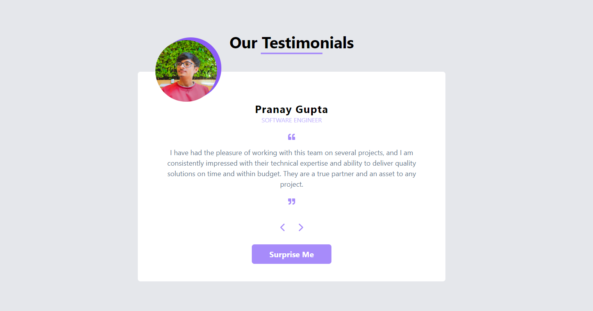

# 🌟 Testimonial Section UI with React 🌟

A fun and interactive Testimonial Section built with React, featuring a dynamic UI design, navigation controls for testimonial cards, and a surprise random testimonial display.



## Features

✨ **Interactive UI**: Easily navigate through testimonials using intuitive controls.

🔄 **Random Testimonial**: Click the "Surprise Me" button for a delightful random testimonial.

🎨 **Stylish Design**: A visually appealing design to make your testimonials shine.

🧩 **Modular React Components**: Built using reusable React components for maintainability.

## Installation

To run this project locally, follow these steps:

1. Clone the repository:

   ```bash
   git clone https://github.com/your-username/testimonial-section-react.git
   ```

2. Navigate to the project directory:

   ```bash
   cd testimonial-section-react
   ```

3. Install dependencies:

   ```bash
   npm install
   ```

4. Start the development server:

   ```bash
   npm start
   ```

5. Open your browser and visit [http://localhost:3000](http://localhost:3000) to view the Testimonial Section.

## Usage

1. Browse through the testimonials using the navigation arrows.

2. Click the "Surprise Me" button to display a random testimonial.

## Customization

Feel free to customize the testimonials, add more data, or change the design to suit your project's needs. The code is modular and easy to adapt.

## Contributing

Contributions are welcome! If you have any ideas, suggestions, or improvements, please open an issue or create a pull request.

## Credits

- Testimonials and design by [Anuj Trivedi](https://anuj-vfolio.netlify.app).
